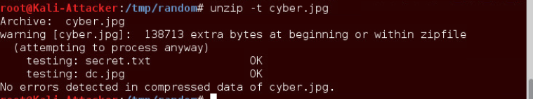
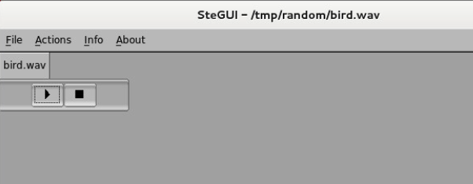
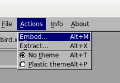

 Hiding a Hidden Message Within a Picture

**1.1 Using Steghide to Hide Hidden Messages**

1.  Launch the Kali virtual machine to access the graphical login
    screen.

2\. Log in as root with toor as the password. Open the Kali PC Viewer.

> 3\. Click on the terminal icon located in the top menu bar.
>
> 4\. While in the *terminal*, navigate to the **/tmp/random**
> directory.
>
>  alt="A black background with red and blue text Description automatically generated with low confidence" />

5\. Create a new text document with the *nano* text editor to create a
message to hide.

6\. Once engaged in the *nano* text editor, type the message below.

7.  Once finished, press **CTRL+X** to exit and save.

8.  When prompted to save the file, type Y for *Yes*.

> 9\. When prompted for the filename, verify **secret.txt** as the file
> name and press **Enter**.

10\. Verify the capacity of the *earth.jpg* image to see what the
capacity is for being able to hide a message within the image itself.

11\. Notice the capacity amount. When asked to get more information
about embedded data, type **N**.

12\. See how large the *secret.txt* file is to confirm whether we can
hide it within the *earth.jpg* image. Use the **–b** option to display
the file size in terms of bytes.

13\. Before we embed the *secret* message, confirm the *sha1 hash* value
for the *earth.jpg* image file.

14\. Type the command below to initialize the process of hiding the
secret message. When prompted for a passphrase, type secret followed by
pressing **Enter**. Type secret once more. Press **Enter**.

15\. Verify the *hash value* again with the same *earth.jpg* image file.

16\. Type the command below to gather info on the embedded data within
the **earth.jpg** file. When asked to get information about embedded
data, type Y. Type secret as the passphrase. Press **Enter**.

17\. Attempt to extract the secret data within the *earth.jpg* image
file. When prompted for the passphrase, type secret followed by pressing
**Enter**. When prompted that the file *secret.txt* already exists, type
Y to overwrite.

18\. Confirm that the secret message has been preserved by viewing the
contents.

19\. Leave the *terminal* window open to continue with the next task.

2\. **Hiding Multiple Files Within an Image File**

2.1 **Using Basic Linux Commands to Hide Zipped Archives**

**1.** While still on the *Kali* system, in the terminal window, verify
that you are currently in the **/tmp/random** directory. List the files
in the current directory using the command below. Take note of the file
sizes for both *cybersec.jpg* and *secret.txt*.

2\. Create a *zipped* archive named **secret_files** to include the
files: **secret.txt** and **dc.jpg**. 

3\. List the current files in the directory to verify that
*secret_files.zip* is present.

4\. Using the **cat** command, enter the command below to hide the
zipped archive within the image file called **cybersec.jpg**. This will
enable the *cat* command to concatenate the image and zip file together
in a new file named **cyber.jpg**.

5\. List the files in the current directory to verify that the
**cyber.jpg** image file has been

successfully created. Also, take note of the file size and compare it to
**cybersec.jpg**.

6\. Initiate the **unzip** command against the **cyber.jpg** image file
in an attempt to extract the data hidden within the image file.

7\. Leave the *terminal* window open to continue with the next task.

3\. **Hiding a Text File Within an Audi**

**3.1. Using SteGUI to Hide Text File**

While still on the *Kali* system, type the command below in a *terminal*
shell to launch the *SteGUI* application. (*SteGUI* is case-sensitive)

> 3\. Within the *Choose file to open* window, select the **drop-down
> menu** next to *Show:* and select **Audio files**. Towards the bottom
> of the window, notice the *white space* after *Filename*. Type
> /tmp/random/bird.wav. Select the audio file and click **OK**.

> 4\. Next, click the **Actions** file menu option and click on
> **Embed**.

5.  Another pop-up window appears. Click the **white space** area for
    *File to embed in*

> *cover file* and type /tmp/random/secret.txt.
>
> 6\. Verify that **/tmp/random/bird.wav** is the selected file for
> *File to use as cover*.
>
> 7\. For *File to use as output stegofile*, click in the white space
> and type /tmp/random/bird.wav.
>
> 8\. Check the checkbox for **Overwrite output file**

> 9\. Type **secret** as the *Passphrase*.
>
> 11\. When prompted that the *Steghide* message completed successfully,
> click **OK**.  
> 12. Confirm that the *secret.txt* file is embedded in the *bird.wav*
> file by clicking on the
>
> **Info** menu option and clicking on **Get open file info**.
>
>  alt="A screenshot of a computer Description automatically generated with medium confidence" />

13\. When asked to supply a *passphrase*, click **Yes**.

>  alt="A screenshot of a computer error Description automatically generated with low confidence" />
